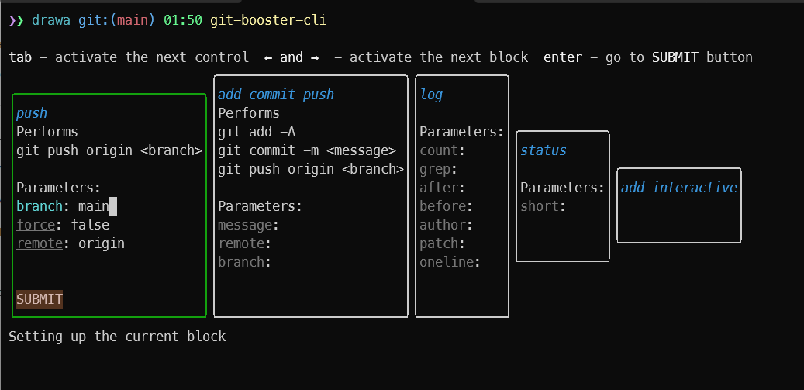
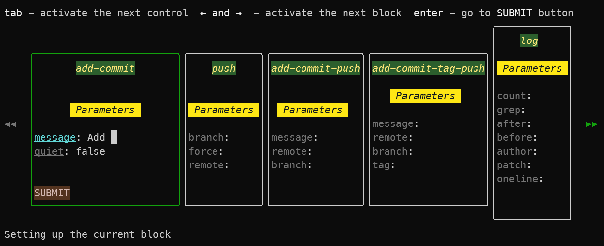
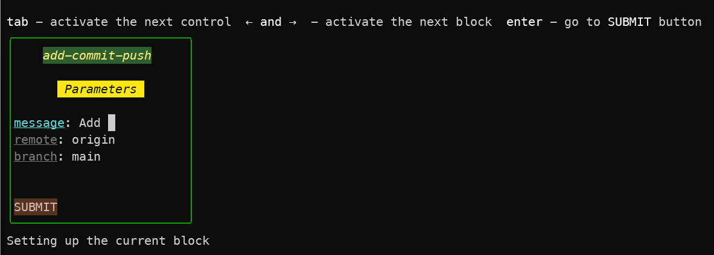

# git-booster-cli [![NPM version][npm-image]][npm-url]

> Improve your git workflow with customizable and runnable blocks

## Install

```bash
$ npm install --global git-booster-cli
```

## CLI

```
$ git-booster-cli --help

  Improve your git workflow with customizable and runnable blocks

  Usage
    $ git-booster-cli

  Options
    --all, -a            Display all available blocks
    --only, -o           Display only specified block
    --compound, -c       Display only blocks with multiple command sets
    --short-statuses, -s Use short status notations for change types
    --tag, -t            Display only blocks having specified tags (separated by comma)

  Examples
    $ git-booster-cli --all
    $ git-booster-cli --compound
    $ git-booster-cli --only addCommitPush
    $ git-booster-cli --no-short-statuses
    $ git-booster-cli --tag "add,commit,reset,restore"
```

## Demo


## Screenshots

Launched app with main blocks

```
git-booster-cli --all
```



Launched app with all blocks

```
git-booster-cli --all
```



Launched app with single block by name

```
git-booster-cli --only add-commit-push
```



## License

MIT © [Rushan Alyautdinov](https://github.com/akgondber)

[npm-image]: https://img.shields.io/npm/v/git-booster-cli.svg?style=flat
[npm-url]: https://npmjs.org/package/git-booster-cli
