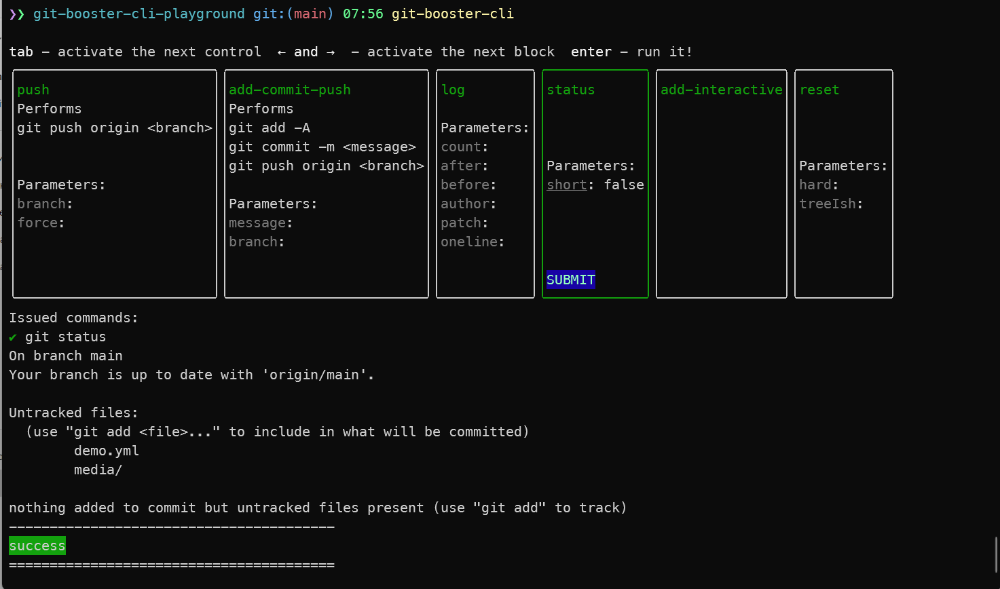

# git-booster-cli [![NPM version][npm-image]][npm-url]

> Improve your git workflow with customizable and runnable blocks

## Install

```bash
$ npm install --global git-booster-cli
```

## CLI

```
$ git-booster-cli --help

    Usage
    $ git-booster-cli

  Options
      --all            Display all available blocks
      --short-statuses Use short status notations for change types
      --tag            Display only blocks having specified tags (separated by comma)


  Examples
    $ git-booster-cli --all
    $ git-booster-cli --no-short-statuses
    $ git-booster-cli --tag add,commit,reset,restore
```

## Demo


## Screenshots

Launched app with all blocks

```
git-booster-cli --all
```




## License

MIT © [Rushan Alyautdinov](https://github.com/akgondber)

[npm-image]: https://img.shields.io/npm/v/git-booster-cli.svg?style=flat
[npm-url]: https://npmjs.org/package/git-booster-cli
